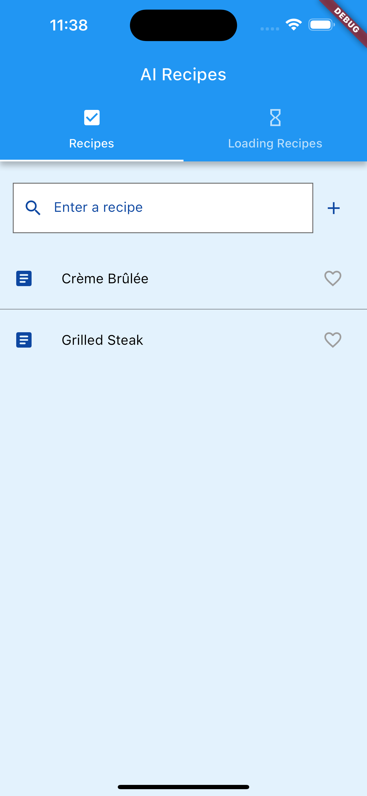

# AI Recipe App

## Overview

An AI Recipe app built in Flutter using [ConjureAPI](https://www.conjureapi.com/).

It displays a list of recipes added by the user:



Allows the user to add new recipes:


And view interactive recipes generated by GPT-3.5:


## Data Generation

Data is generated using [ConjureAPI](https://www.conjureapi.com/) which allows content generation matching a specific JSON format.

The following is the schema provided to ConjureAPI:

```json
{
  "title": {
    "type": "string"
  },
  "description": {
    "type": "string"
  },
  "servings": {
    "type": "integer",
    "minimum": 1
  },
  "prepTime": {
    "type": "string",
    "pattern": "^(([1-9][0-9]*h)?\\s*)?([1-5][0-9]m)?$"
  },
  "cookTime": {
    "type": "string",
    "pattern": "^(([1-9][0-9]*h)?\\s*)?([1-5][0-9]m)?$"
  },
  "ingredients": {
    "type": "array",
    "items": {
      "type": "object",
      "properties": {
        "name": {
          "type": "string"
        },
        "quantity": {
          "type": "string"
        },
        "unit": {
          "type": "string"
        },
        "notes": {
          "type": "string"
        }
      },
      "required": [
        "name",
        "quantity"
      ]
    },
    "minItems": 1
  },
  "steps": {
    "type": "array",
    "items": {
      "type": "object",
      "properties": {
        "stepNumber": {
          "type": "integer",
          "minimum": 1
        },
        "instruction": {
          "type": "string"
        },
        "notes": {
          "type": "string"
        }
      },
      "required": [
        "stepNumber",
        "instruction"
      ]
    },
    "minItems": 1
  },
  "notes": {
    "type": "string"
  }
}
```

The recipe entered by the user is sent as a part of the query string to the ConjureAPI endpoint.

The ConjureAPI endpoint is configured in a `.env` file:

```sh
CONJURE_API_URL=https://www.conjureapi.com/endpoints/<endpoint>
CONJURE_API_APPLICATION_ID=<Application ID>
CONJURE_API_ACCESS_TOKEN=<Application Access Token>
```

## Building and Releasing

Follow these official guides:
- [Getting Started (Running Locally)](https://docs.flutter.dev/get-started/install)
- [Building and Releasing](https://docs.flutter.dev/deployment/ios)
